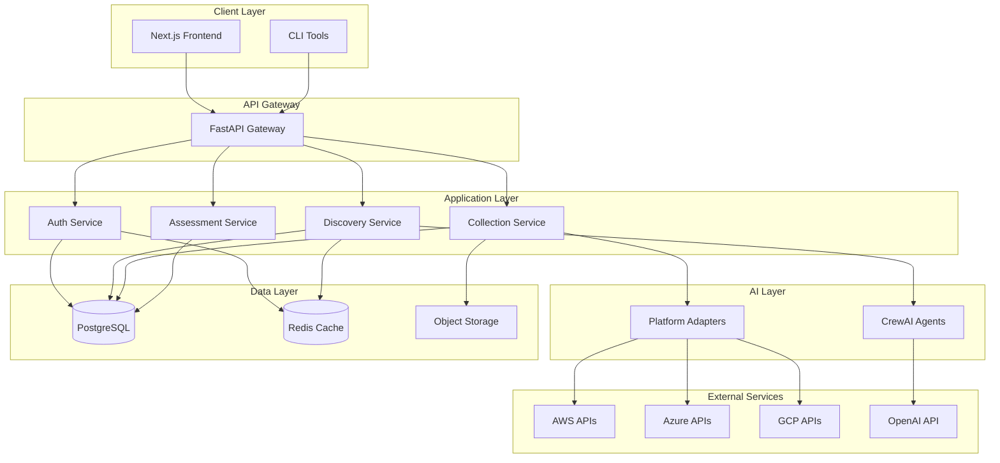
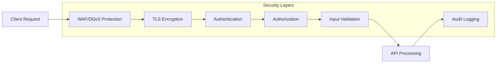

# AI-Discover Architecture Overview

## System Architecture

AI-Discover is built as a modern, microservices-ready monolithic application with clear separation of concerns and the ability to scale individual components as needed.



## Component Architecture

### Backend (FastAPI)

```
backend/
├── app/
│   ├── api/              # API endpoints
│   │   └── v1/
│   │       └── endpoints/
│   ├── core/             # Core functionality
│   │   ├── config.py     # Configuration
│   │   ├── database.py   # Database setup
│   │   ├── security.py   # Security utilities
│   │   └── celery.py     # Task queue
│   ├── models/           # SQLAlchemy models
│   ├── schemas/          # Pydantic schemas
│   ├── services/         # Business logic
│   ├── crews/            # CrewAI agents
│   └── adapters/         # Cloud adapters
```

### Frontend (Next.js)

```
frontend/
├── src/
│   ├── app/              # Next.js app router
│   ├── components/       # React components
│   ├── lib/              # Utility libraries
│   ├── hooks/            # Custom React hooks
│   ├── store/            # Zustand state management
│   └── api/              # API client
```

## Data Flow

### Discovery Flow

1. **Initiation**: User starts discovery through UI/API
2. **Platform Detection**: System identifies available platforms
3. **Tier Assessment**: CrewAI agents determine automation level
4. **Data Collection**: Adapters gather data from platforms
5. **Gap Analysis**: Agents identify missing information
6. **Manual Collection**: UI presents forms for missing data
7. **Assessment**: System generates 6R recommendations
8. **Reporting**: Results presented to user

### Security Architecture



## Technology Stack

### Core Technologies

- **Backend**: Python 3.11+, FastAPI, SQLAlchemy, Celery
- **Frontend**: Next.js 14+, React 18+, TypeScript, Tailwind CSS
- **Database**: PostgreSQL 15+, Redis 7+
- **AI/ML**: CrewAI, LangChain, OpenAI GPT-4
- **Infrastructure**: Docker, Kubernetes, GitHub Actions

### Development Tools

- **Testing**: pytest, Jest, React Testing Library
- **Security**: Semgrep, Trivy, OWASP ZAP
- **Monitoring**: OpenTelemetry, Prometheus
- **Documentation**: OpenAPI/Swagger, Storybook

## Deployment Architecture

### Container Strategy

```yaml
Services:
  - backend: FastAPI application
  - frontend: Next.js application
  - worker: Celery workers
  - scheduler: Celery beat
  - cache: Redis
  - database: PostgreSQL
```

### Scaling Strategy

1. **Horizontal Scaling**: All services designed for horizontal scaling
2. **Auto-scaling**: Based on CPU/memory metrics
3. **Load Balancing**: Application load balancer for distribution
4. **Caching**: Multi-level caching strategy
5. **CDN**: Static assets served via CDN

## Design Principles

### 1. Separation of Concerns
- Clear boundaries between layers
- Single responsibility principle
- Dependency injection

### 2. Security First
- Defense in depth
- Least privilege access
- Encryption at rest and in transit

### 3. Scalability
- Stateless services
- Async processing
- Efficient caching

### 4. Maintainability
- Comprehensive testing
- Clear documentation
- Consistent coding standards

### 5. Observability
- Structured logging
- Distributed tracing
- Metrics collection

## Integration Points

### Cloud Platform Adapters

Each adapter implements a common interface:

```python
class CloudAdapter(ABC):
    @abstractmethod
    async def discover_resources(self) -> List[Resource]:
        pass
    
    @abstractmethod
    async def get_resource_details(self, resource_id: str) -> ResourceDetails:
        pass
    
    @abstractmethod
    async def validate_credentials(self) -> bool:
        pass
```

### CrewAI Agent Architecture

```python
class DiscoveryAgent:
    tools = [
        CloudPlatformScanner(),
        ResourceAnalyzer(),
        DependencyMapper(),
    ]
    
    async def analyze_environment(self) -> EnvironmentAssessment:
        # Agent logic here
        pass
```

## Performance Considerations

### Optimization Strategies

1. **Database**: 
   - Connection pooling
   - Query optimization
   - Proper indexing

2. **Caching**:
   - Redis for session data
   - API response caching
   - Static asset caching

3. **Async Processing**:
   - Async API endpoints
   - Background task processing
   - Parallel data collection

4. **Frontend**:
   - Code splitting
   - Lazy loading
   - Image optimization

## Security Measures

### Application Security

- Input validation on all endpoints
- SQL injection prevention via ORMs
- XSS protection in React
- CSRF tokens for state-changing operations
- Rate limiting on all endpoints

### Infrastructure Security

- Network isolation
- Secrets management (HashiCorp Vault)
- Regular security scanning
- Automated dependency updates

## Future Considerations

### Planned Enhancements

1. **Multi-tenancy**: Full isolation between tenants
2. **Plugin System**: Extensible adapter framework
3. **Real-time Updates**: WebSocket support
4. **Mobile Apps**: React Native clients
5. **Advanced Analytics**: ML-based insights

### Scalability Path

1. **Phase 1**: Single region deployment
2. **Phase 2**: Multi-region with replication
3. **Phase 3**: Global distribution with edge computing
4. **Phase 4**: Serverless components for burst scaling